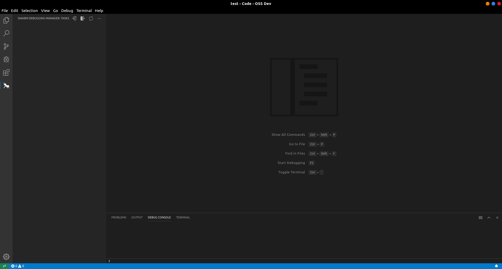
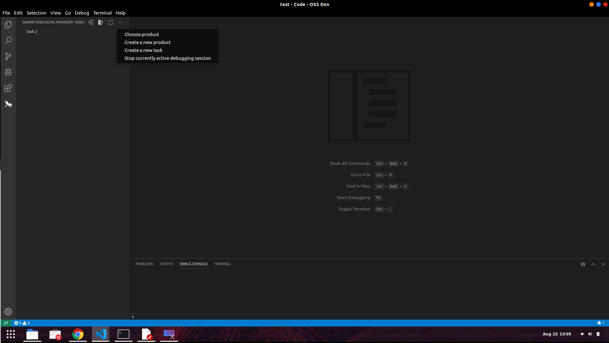
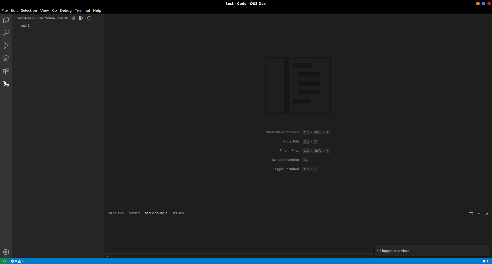

# Swarm Debugging Manager

The Swarm Debugging Manager is a vscode extension used to manage Swarm Debugging accounts, products and tasks. It is included in the [Swarm Debugging version of vscode](https://github.com/SwarmDebugging/SwarmDebuggingVSCode). 

## How to use

To use in plain vscode, download and place directly in vscode's extensions folder, you can also use the Swarm Debugging version of vscode. 
You will need to setup the [Swarm Server](https://github.com/SwarmDebugging/SwarmServer) for it to function properly.

Using the extension is very simple, once vscode opened there will be an ant icon on the left side of the browser, it is the Swarm Debugging Manager extension, click on it. Then, you will have to log in, the extension will ask you if you want to log in an existing account or create a new one.
after that, you will need to choose the product to work on, if you don't have any products created, you can create one in the drop down menu. Then you will have to add tasks to your product, again in the drop down menu. The task will show in the tree view, while hovering on it you can see the task's commands: edit the task name, mark the task as done, start a debugging session or toggle breakpoint storage. 
starting a session will record all the events that can happen in a debugging session, like stepping in, stepping out, continue and more (only in Swarm Debugging version of vscode). toggling breakpoints will store all the breakpoints in the database and register any addition or deletion of breakpoints. A Swarm Debugging session is stopped when the user clicks the stop currently active session in the drop down menu or when the debugging session ends.

